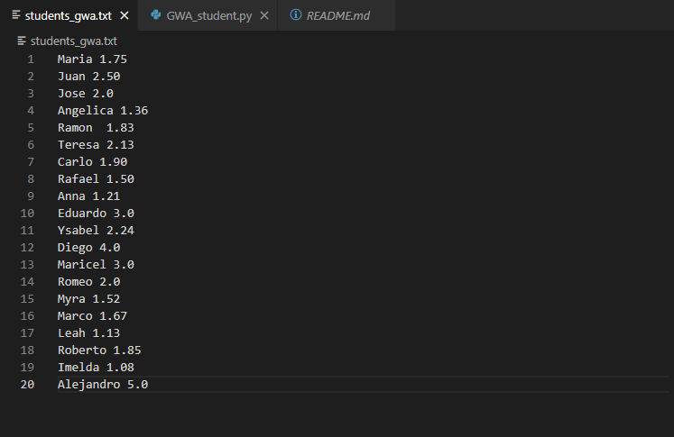
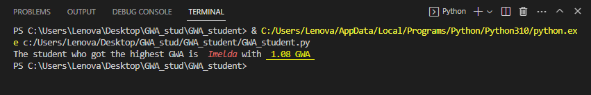

# GWA_student
### Programming Exercise 2

Write a Python program that read a file containing the name of 20 students together with their GWA. The program will outputs the name of the student who got the highest GWA (including the GWA).

# 20 Students with their GWA Contained in students_gwa.txt

# Example Output

# How To Use / Run
1. Install Python on your computer to run the code. You can download its latest version here: https://www.python.org/downloads/ 
2. Copy the code from the repository. 
3. Open an IDE and paste the code. 
4. Save the file with a .py extension. 
5. Run the code. 
